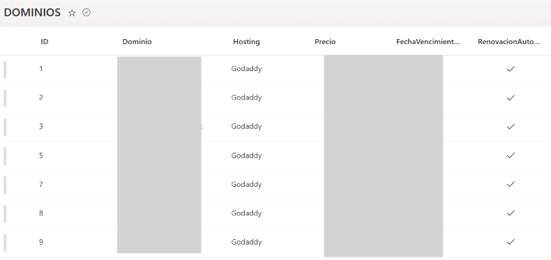
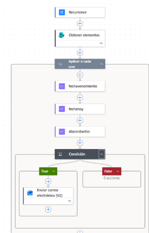
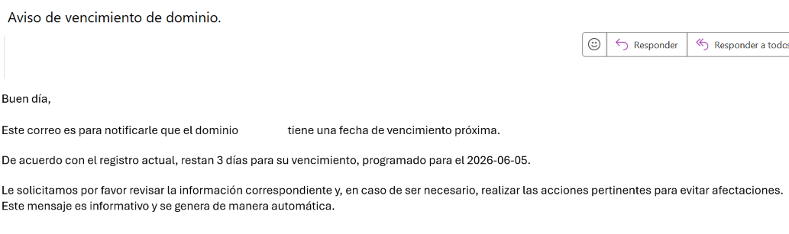

# Automatizacion y Administración de Dominios

# Descrición del Proyecto
La solución nos permite centralizar la información de los dominios dentro de una lista de SharePoint, registrando los datos más relevantes, como el nombre, hosting, precio, proveedor, costo, fecha de vencimiento y el estado de renovación automática, facilitando la administración y consulta de información.

Mediante la automatización del flujo con Power Automate, ejecutado diariamente a las 09:00 horas, el sistema realiza la validación de las fechas de vencimiento registradas y calcula los días restantes para que el dominio se venza. Cuando el dominio se encuentra a 7 días de vencer, se genera una notificación automática por correo electrónico dirigida al personal de sistemas y al responsable del área de pagos.

La solución permite tener un control centralizado de los dominios corporativos, anticipando la renovación y reduciendo el riesgo de la expiración de algún dominio.

# Problematica
La administración de los dominios se manejaba únicamente por medio de un archivo de Excel, por lo que en ocasiones no se recordaba la renovación de algún dominio importante y este llegaba a vencerse. Además, no existía ningún tipo de alerta que notificara la proximidad de la fecha de vencimiento, aumentando el riesgo de afectar páginas web, servicios de hosting y otros recursos asociados, lo que afectaba principalmente el comercio electrónico o la comunicación interna.

# Objetivo 

Desarrollar una solución automatizada para el monitoreo de dominios y servicios de hosting, generando una notificación automática sobre los próximos vencimientos con el fin de anticipar el proceso de renovación, reduciendo los riesgos de interrupciones en los servicios y mantener un flujo correcto y un mayor control sobre los activos digitales de la organización.

# Tecnologías Utilizadas
- Sharepoint
- PowerAutomate
- Outlook
- Microsoft 365

# Funciones Principales
- Registro de dominios y servicios de hosting.
- Consulta de información.
- Monitoreo de fechas de vencimiento.
- Cálculo automático de días restantes.
- Envío de notificaciones automáticas por correo electrónico.
- Seguimiento de renovaciones.

# Flujo del Proceso

Registro de dominio
↓
Power Automate ejecuta la validación
↓
Consulta fecha de vencimiento
↓
Cálculo de días restantes
↓
¿Faltan 7 días?
↓
Sí
↓
Generación de correo electrónico automático
↓
Personal de sistemas
↓
Personal de pagos
↓
Renovación

# Resultados Obtenidos

Gracias a la implementación de esta solución se mejoró la gestión y administración de dominios y hosting, reduciendo significativamente el riesgo de vencimientos por falta de seguimiento adecuado.

La automatización de las notificaciones permitió anticipar los procesos de renovación, manteniendo informados tanto al área de TI como al responsable del área de pagos de los próximos vencimientos.

Asimismo, se logró centralizar y tener un control de la información relacionada con los servicios de hosting y dominios, facilitando la consulta, seguimiento y administración.

# Base de Datos

# Flujo de PowerAutomate

# Notificación 

